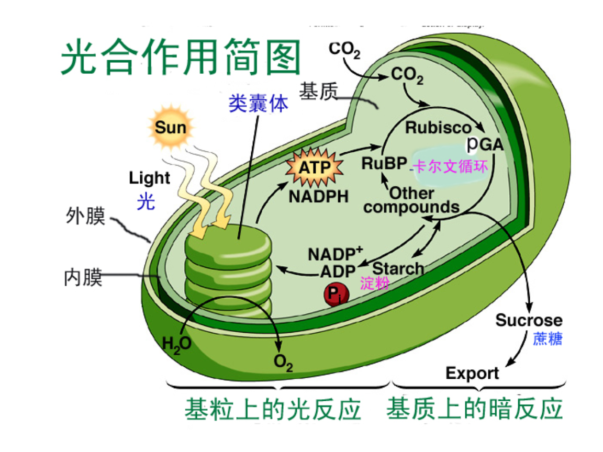
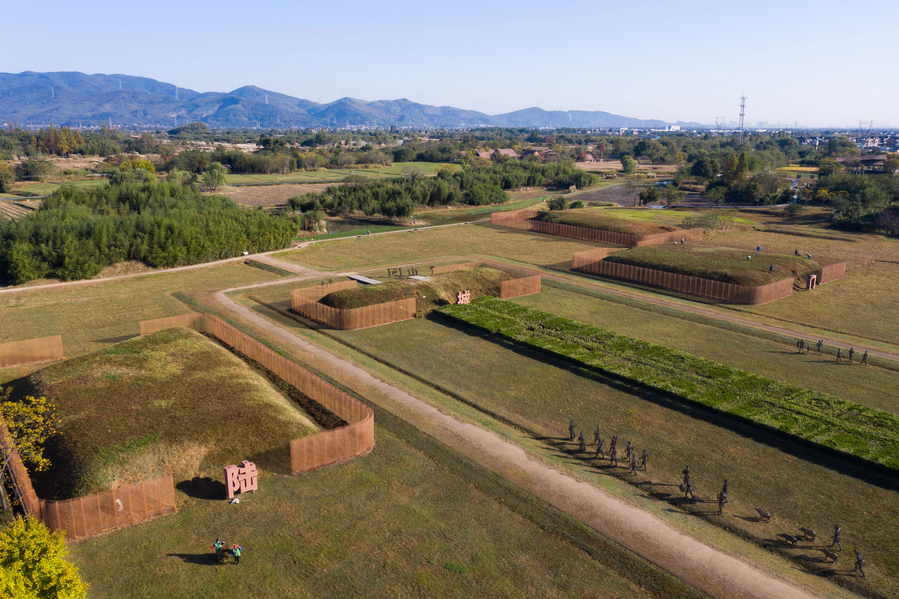

# 从一粒种子到一片森林：植物如何改变地球<br>
## 一、生命的绿色革命  
大约 4.7亿年前，地球上发生了一场静默却深刻的变革——植物从海洋登陆。这场"绿色革命"彻底重塑了地球的面貌，为后续所有陆生生命的演化铺平了道路。  
  
## 二、光合作用的奇迹  
光合作用的化学方程式看似简单，却蕴含着生命最精妙的能量转换机制：  
```
6CO₂ + 6H₂O + 光能 → C₆H₁₂O₆ + 6O₂
```
这个反应的意义远超化学本身：  
**·能量捕获**：将太阳能转化为化学能，成为几乎所有食物链的起点  
**·氧气释放**：改变了地球大气的组成，使需氧生物得以繁荣  
**·碳固定**：调节大气中的二氧化碳浓度，影响全球气候  

  
## 三、植物的五大类群  
|类群|代表植物|关键特征|出现时间|
|---|---|---|---|
|藻类|海带、紫菜|无根茎叶分化，水生|约35亿年前|
|苔藓|葫芦藓|有茎叶但无维管束|约4.7亿年前|
|蕨类|肾蕨、桫椤|有维管束，孢子繁殖|约4.2亿年前|
|裸子植物|松树、银杏|种子裸露，无果实|约3.6亿年前|
|被子植物|玫瑰、小麦|种子包被于果实中|约1.4亿年前|
  
## 四、植物间的"社交网络"  
近年来的研究揭示了一个惊人的事实：植物并非孤立存在，它们通过地下的菌根网络相互连接，形成了一个庞大的"植物互联网"，科学家称之为 **["Wood Wide Web"](https://www.kepuchina.cn/article/articleinfo?business_type=100&classify=0&ar_id=733894)**。  
### 4.1 菌根网络的运作方式:  
```
# 简化的菌根网络信息传递模型
class MycorrhizalNetwork:
    def __init__(self):
        self.fungi_connections = {}
    
    def send_signal(self, sender, receiver, signal_type):
        """植物通过真菌网络发送化学信号"""
        if signal_type == "danger":
            receiver.activate_defense_genes()
        elif signal_type == "nutrient_request":
            sender.transfer_carbon(receiver)
        elif signal_type == "resource_sharing":
            self.redistribute_resources(sender, receiver)
```
通过这个网络，植物可以：  
**·传递警报**：当一棵树遭受虫害时，它会通过根系向邻近树木发送化学信号，触发它们的防御机制  
**·共享养分**：老树可以通过真菌网络向幼苗输送碳和氮，帮助它们在树荫下存活  
**·识别亲缘**：一些研究表明，植物能够识别并优先帮助与自己有亲缘关系的个体  
  
## 五、植物与人类文明的交织  
植物的驯化是人类文明诞生的基石。以下是几种改变历史的作物：  
**·小麦**：约1万年前在新月沃地被驯化，催生了农业文明  
**·水稻**：约9000年前在中国长江流域被驯化，养活了亚洲数十亿人口  
**·玉米**：约9000年前在墨西哥被驯化，成为美洲文明的支柱  
**·棉花**：推动了工业革命，也深刻影响了全球贸易格局  

  
## 六、当代挑战与未来  
### 6.1 气候变化下的植物  
全球变暖正在改变植物的分布和物候：  
·高山植物向更高海拔迁移  
·开花时间提前，影响传粉者同步性  
·极端天气事件增加，威胁作物产量  
### 6.2 保护与可持续利用  
我们可以采取以下行动：  
**·支持本地农业**：减少食物运输的碳足迹  
**·保护原生植被**：维护生物多样性和生态系统服务  
**·参与公民科学**：记录身边的植物变化，为研究提供数据  
**·减少食物浪费**：全球约三分之一的食物被浪费，相当于浪费了生产这些食物所需的土地和水资源  

## 七、结语  
从一粒微小的种子到覆盖地球的绿色森林，植物用数亿年的时间书写了一部壮丽的生命史诗。它们不仅是地球生态系统的基石，更是人类文明的伙伴。在这个充满挑战的时代，理解并尊重植物，或许是我们走向可持续未来的关键一步。  
>*["我们不是从祖先那里继承了地球，而是从子孙那里借来了它。"](https://www.kepuchina.cn/article/articleinfo?business_type=100&classify=0&ar_id=733894)* —— Native American Proverb
